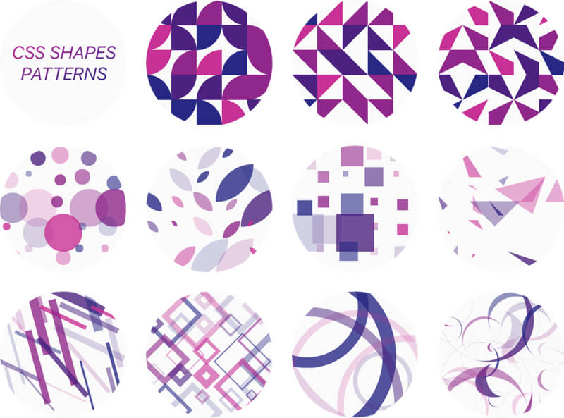

# CSS Shapes Patterns

</br> </br>

</br> </br>

### Pattern definition

```html
<x-pattern>
  _.backgroundColor = color();
  _.borderRadius = rangeOf(100)  + '%';
  _.transform = rangeOf(180)  + 'deg';
</x-pattern>
```

### Gallery

[https://yuanchuan.github.io/css-shapes-patterns/](https://yuanchuan.github.io/css-shapes-patterns/)
